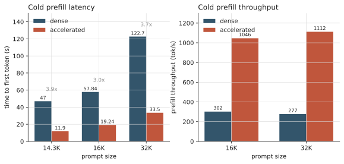
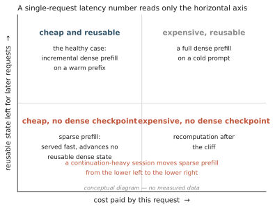
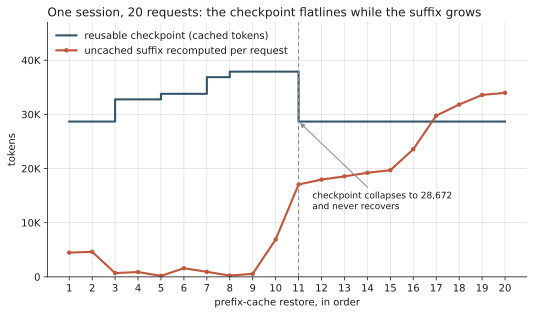
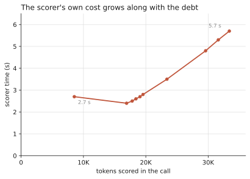
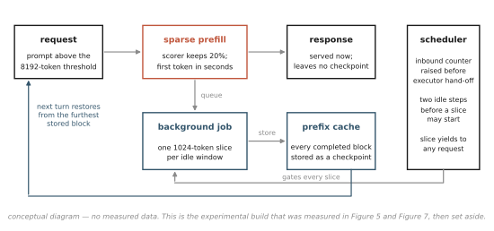
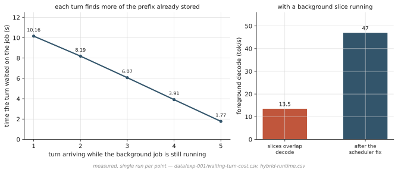
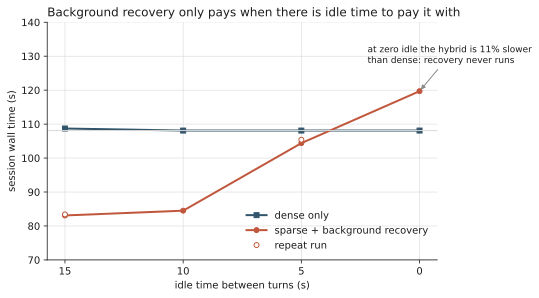
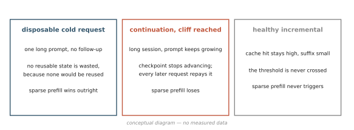
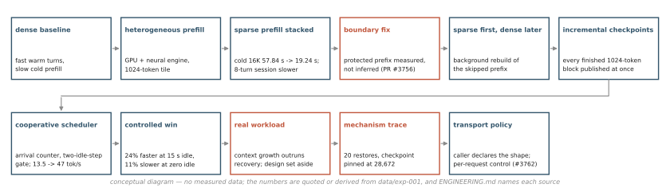

# 當 prefill 變快，agent 反而變慢

16K 冷啟動的首字延遲，我從 57.84 秒壓到 19.24 秒；32K 從 122.7 秒壓到 33.5 秒。
量完這兩組數字，我把同一套設定接上一個真的在寫程式的 agent。整個 session 反而慢了
不少。

優化本身照設計運作，問題出在我量錯了東西。

## 那個一眼就看得出來的瓶頸

單機跑 27B 等級的 dense 模型，長 context 的痛點不用找：使用者按下 enter，整段
prompt 得先算完一遍，第一個 token 才會出來。32K 的 prompt 要等兩分鐘，而且這兩分鐘
沒有任何東西能遮。

所以 prefill 就成了目標。我走了兩條路。第一條是把一部分計算搬到 ANE：把模型的 MLP
與 gated-delta-net 層切一部分給 ANE，固定 1024 token 一片，兩個 ANE 實例並行。第二
條是 SpecPrefill（一種 attention-based 的 sparse prefill 機制）：先用一顆 0.8B 的小
模型替 prompt 裡每個 token 評分，只有分
數最高的 20% 走完整的 attention，其餘略過。超過 8192 token 的 prompt 才啟用。

## 冷啟動：3 到 4 倍

| prompt | dense | 加速後 | |
|---|---:|---:|---|
| 14.3K | 47.0 s | 11.9 s | 3.9x |
| 16K | 57.84 s | 19.24 s | 3.0x |
| 32K | 122.7 s | 33.5 s | 3.7x |



Prefill 吞吐在 16K 從 302 tok/s 到 1046 tok/s，32K 從 277 到 1112。兩個機制也不
互相干擾：在只有一個常駐 engine 的隔離測試裡，16K 同時開啟約 1328 tok/s，對照約
300 tok/s，疊加效果達到理想乘積的 95-97%。這在當時是整個研究裡最漂亮的結果。

這些數字到現在我都認。問題是它們回答的是哪個問題。

## 反轉

真正的 coding agent session 長這樣：第一個請求帶著系統提示、工具定義、專案脈絡，
本身就是長 prompt。Agent 讀檔、跑指令、再問一次；第二個請求是第一個加上新內容，
第三個再加。到第八輪，prompt 比一開始大很多，但絕大部分跟第七輪一模一樣。

這種形狀的 workload 早有對策，叫 prefix cache：把算過的 KV 狀態存起來，下一個請求
只算新增的尾巴。平常它運作得很好。

我開著 SpecPrefill 跑真的 agent，記錄每一輪的 cache 命中率：

| 輪次 | dense | sparse |
|---:|---:|---:|
| 1 | 82.2% | 88.2% |
| 2 | 94.0% | 63.9% |
| 3 | 75.6% | 51.0% |
| 4 | 98.6% | 40.7% |
| 8 | 98.1% | 27.1% |

第一輪 sparse 還領先，之後一路掉到 27%；dense 那邊第三輪掉了一次，後幾輪回到 98% 上下。

先講清楚這張表能信到什麼程度：兩邊各只跑一次，而且兩個 agent 面對同一個任務走了
不同的路，工具呼叫也不一樣。所以「dense 約 1676 秒、sparse 約 4404 秒」這組 session
總時間，不是能引用的倍率。它只告訴我有東西壞了，值得查。

受控的版本更能說明問題：同一個八輪、16K 的合成 session，dense 跑 108.1 秒，開著
sparse prefill 跑 129.1 秒，慢了 21 秒。

## 我漏掉的變數

量 prefill 的時候，我量的是「這個請求花了多少時間」。

但一個請求還會做另一件事：留下可以重複使用的狀態。Dense prefill 算完整段 prompt，
結果寫回 prefix cache，下一個請求接著用。Sparse prefill 跳過八成的 token，算出來的
KV 是有洞的。服務當下這個請求沒問題，評分挑出來的本來就是重要的 token；但這份狀態
不適合存起來，因為下一個請求會拿到一份殘缺的歷史。

sparse prefill 快歸快，但 sparse 化的尾巴不會推進正常可重用的 dense prefix
state；單看單次延遲，這一項根本不在帳上。



## cliff 是怎麼發生的

上面的命中率表是觀察，不是機制。要看機制，我需要一條乾淨的軌跡：單一 server
process，只開 SpecPrefill，build 裡不含背景回填，免得多一個變因干擾判讀。

拿到的是連續 20 次 prefix cache 還原。



藍色階梯是可重用的 checkpoint：28,672 往上走到 32,768、33,792、36,864、37,888，正常。
紅線是每個請求必須重算的未快取尾巴，起初只有幾百到幾千個 token，也正常。

第 11 個請求，checkpoint 掉回 28,672。

然後就停在那裡。剩下十個請求，藍色階梯是一條水平線；紅線從 17,060 爬到 33,979。

伺服器日誌記下了那一刻的直接原因：

```
ArraysCache layer 0: partial prefix match detected (placeholder in last
matched block). Rejecting cache to prevent stale GDN state. Request will
reprocess from scratch.
```

順序值得說清楚，因為很容易讀反。第 10 個請求還原了 37,888 個 token，尾巴 6,902，在
8192 的門檻以下，所以它走的是 dense。第 11 個請求還原的時候只剩 28,672：cache 層在
最後一個匹配的 block 裡看到 placeholder，判定這是一個只對到半個 block 的 partial
match，於是拒絕整份快取。這個模型混合了 attention 與 GDN 的 recurrent state，而
recurrent state 沒辦法從半個 block 接著算，拿去用就是拿到舊狀態。

**這次還原就是 cliff，而它發生在 sparse admission 之前。**被拒絕之後，這個請求留下
17,060 個 token 的 miss，超過 8192，SpecPrefill 這才接手。從這裡開始，每一個尾巴都
在門檻以上、都被 sparse 化，而 sparse 化的尾巴不會推進 dense checkpoint，所以
checkpoint 再也沒有恢復。之後累積的重算，就是從這裡長出來的。

說得更精確一點：request 11 的 sparse admission 不是這次 cliff 的成因，因為 restore
先發生。至於那個 placeholder 是什麼時候、循哪條路徑留下的，log 只寫了「最後一個
match 到的 block 裡有 placeholder」，而我手上這份 trace 沒辦法把它的來源追出來。
sparse prefill 確實會在沒算完的 block 裡留下 placeholder，但我不會用「有這個能力」
去補上「就是它做的」。cliff 的起因在這裡是開放的；cliff 之後那十個請求不是。

那個拒絕本身是對的，我不打算改它，改了就是拿正確性換延遲。代價是：最後一份可信的
checkpoint 停在 cliff 之前，而 context 還在繼續長。

Checkpoint 寫入停在 44,032 token，之後一筆都沒有：sparse prefill 的結果 cache 不
收，根本沒東西可寫。

## 債會滾利

我把那個瞬間叫 **cache cliff**：可重用的 dense checkpoint 落後於當前 context 的那
一刻。之後累積起來、因為狀態再也追不回而必須反覆重算的部分，叫 **prefix-cache
debt**。

這兩個詞是我在這份研究裡定的，不是既有術語。我需要名字，是因為「cache 命中率下
降」把一個會自我放大的過程講得太平淡。

放大的環節在這裡：SpecPrefill 的評分器（scorer）自己也要跑。它掃的是未快取的尾巴，
而尾巴的長度就是債的大小。



從 8,535 個 token 花 2.7 秒，到 33,389 個 token 花 5.7 秒。這個優化的 overhead，跟
著它自己製造出來的債一起長。

## 那能不能還？

第一個想到的辦法：agent 在思考、在等使用者、在跑工具的時候，機器是閒的。用那段
閒置時間把 dense 版本補算回來，checkpoint 就能重新前進。



架構很直覺。請求先走 sparse，回應照常送出；同時把這段 prompt 截到整數個 cache
block，排進背景佇列。排程器沒事做的時候，就從佇列裡拿一片出來走正常的 dense
prefill，每算完一個 block 就用一般的 store 路徑寫進 prefix cache。下一輪進來的時
候，補到哪裡就能用到哪裡；而 SpecPrefill 原本的 admission 邏輯是看未快取尾
巴的長度決定要不要評分，尾巴縮短，它自己就不評了。

## 要讓背景回填真的留在背景，比想像中麻煩

紙上一段話就講完，跑起來是另一回事。三個 bug，沒有一個跟 prefill 有關，全都在「背景工
作能不能跟請求路徑共存」這件事上。

**身分。** 背景工作要認得「這段對話的下一輪還是同一段對話」。一開始我把模型生成的
輸出也算進工作的身分裡，結果每一輪 chat template 重新 render 之後，同一段對話看起來
像另一段，工作被砍掉重來。改成只追蹤 prompt token 之後才穩。

**看不見請求。** 排程器要等 admission 在 executor 上跑過，才知道有請求進來；而
executor 是單一 worker，一個 step 在跑的時候 admission 排不進去。所以排程器以為自己
閒著，開了一片背景工作，早就到門口的請求只能排在後面。五個請求這樣總共多等了 6.7
秒。修法是在交給 executor 之前先把一個 inbound 計數器加一，排程器在請求被 admit 之
前就知道它存在。

**餓死接收端。** MLX 的計算在 Python 執行緒裡同步進行，不釋放 GIL，所以一片背景工作
整段期間都握著 GIL，接請求的事件迴圈拿不到執行機會。
兩片背景工作背靠背，中間連一個讓請求報到的空隙都沒有。修法是要求連續兩個 idle
step 才准開下一片，代價是每片多等一個 step interval。

背景切片不再跟 decode 重疊之後，前景生成的吞吐從 13.5 tok/s 回到 47 tok/s，這是單次
量測。13.5 tok/s 的時候使用者
會明顯覺得 assistant 打字變慢；47 tok/s 才感覺不到背景有事在跑。



補回來的 checkpoint 也不用等整段算完才能用。工作以 1024 token 一片推進，每完成一個
block 就寫一次；一輪在工作做到一半時進來，就拿到半個 checkpoint。所以等待中的每一
輪成本會遞減：連續五輪分別是 10.16、8.19、6.07、3.91、1.77 秒。這條遞減序列還決定
了 admission 該怎麼估價。若拿第一輪的價錢當估計，sparse-or-dense 的決策會剛好落在自
己的損益平衡點上，量到的 densification 速率差 1%，八輪 session 就在 81.8 秒和 111.1
秒之間跳。改成用整條序列的平均值，才離開那個刀口。

這個背景工作設計上是要 fail-closed 的：只存已經 dense 算過的 token，一律對齊 block
邊界，在混合 attention 與 recurrent 的模型上只從對齊邊界的狀態快照出發。記憶體吃
緊、cache 壞掉要復原、reset、shutdown，工作直接丟掉。後來對這個實驗 branch 的 review
發現實作並沒有完全做到，細節寫在 repo 的 ENGINEERING.md「Prototype safety review」
一節；這些問題只存在於實驗用的 hybrid build，上線的版本裡沒有背景回填這段程式。

趁 idle 在背景把 dense 補回來這個想法本身能跑，15 秒閒置的測試也確實有效。但這份
原型沒通過那次 review，既不是 production-ready，也不是 upstream-ready。更麻煩的
是，就算把實作的洞全補好，只要 context 長得比回填快，它還是追不上；那是機制本身的
上限，不是 bug。

## 合成測試裡，它成立

我用合成的互動式 workload 測這個架構，參數是每一輪之間的閒置秒數。



| 閒置 | dense only | hybrid |
|---:|---:|---:|
| 15 s | 108.7 s | 83.1 / 83.4 s |
| 10 s | 108.1 s | 84.5 s |
| 5 s | 108.1 s | 104.4 / 105.4 s |
| 0 s | 108.1 s | 119.7 s |

閒置 15 秒時快 24%。5 秒時優勢幾乎消失。完全沒有閒置時，比純 dense 慢 11%。

最後一列才是這張圖的重點。回填要成立，速度必須跑贏 context 的成長；閒置不夠，回填
永遠追不上，而評分器的錢照付。只報「快 24%」不附零閒置那一列，是挑數據。

還有一種還債方式不需要閒置：讓 sparse 之後的下一個 dense 請求把缺口補回來。那 20
次還原裡沒發生過這件事，而且是根本沒機會發生：cliff 之後每個請求的未快取尾巴都在
門檻以上，每一個都走了 sparse。軌跡能告訴我的是帳單有多大：第 11 次要補 17,060 個
token，到第 20 次要補 33,979 個，而中間那些 sparse 請求省下的，最多就是評分器丟掉
的那八成。這是從尾巴序列算出來的推論，不是觀察到還債失敗；我沒有另外跑一組強制插
入 dense 請求的實驗。

## 合成測試為什麼會誤導我

合成 workload 裡，每一輪 prompt 長多少是我設的，成長溫和且穩定；閒置時間也是我
設的。在那個世界裡，回填追得上。

真的 coding agent 不長那樣。它讀一個檔案，整份內容一次塞進 prompt；跑一次測試，輸
出再塞一次。成長是陣發的，工具呼叫密集的時候幾乎沒有閒置，至少我量到的這個 session 是如此。
同一個機制，workload 的形狀一換，結論就反過來。

合成測試還是有用。它準確找出了「回填速度必須跑贏成長速度」這個條件。它做不到的，
是告訴我真實的成長速度有多快。

## 第三種情況

如果故事停在「sparse prefill 在 agent session 裡是負的」，那也不對。

我後來量到另一個真實 agent，同樣只有一次 session：cache 命中率穩定在 84-86%，最大
的真實未快取尾巴約 2.5K，評分器一次都沒被呼叫。SpecPrefill 開著，卻從沒被觸
發，因為 8192 的門檻從沒被跨過。Prefix cache 一直是健康的，沒有東西需要加速。



一次性的長 prompt 冷請求，sparse prefill 明顯贏，反正沒有後續請求會用到那份狀態，
丟掉的東西本來就沒價值。持續延伸並撞上 cliff 的 session，
它輸，而且愈跑輸愈多。健康的漸進式 session，它根本不會被觸發。

這三個樣本各只有一次觀察，真實世界的分布長什麼樣我不知道，只知道它不是單一答案。

## 一個比延遲更硬的問題

追這件事的過程中，我撞到另一個問題，跟速度無關。

SpecPrefill 不能丟掉系統提示和工具定義，那些必須完整處理。實作用一個靜態
的前綴邊界保護它們，而那個邊界是用減法推出來的：拿完整 prompt 的 render，減掉不含
系統訊息的 render。這假設 chat template 不管有哪些 role 都吐一樣的東西，而這個
template 不是。有工具的時候，推出來的邊界比真實邊界短，在這次研究的設定下，差距最小
的一次是 37 個 token。

那 37 個 token 是工具指令的結尾和操作者自己系統提示的開頭。這些本來不能被 sparse
掉的 token，被錯誤算進了可 sparse 的範圍，也就是 protected-prefix contract 被破壞
了。光是這樣就夠嚴重。我沒有量到任何一次因此而生的語意錯誤，所以我不會說模型真的
忽略了那些指令。

修法改成實際量邊界：把靜態訊息用呼叫端自己的 template render 兩次，各接一段不同的拋
棄式對話，取兩次都相同、而且真實 prompt 也以它開頭的那段 token 前綴。兩次探測都
一致的 token，不可能依賴對話內容。

只要會破壞受保護 prompt 的契約，延遲省多少都沒意義。這個修正已提交為 oMLX PR
[#3756](https://github.com/jundot/omlx/pull/3756)，寫這篇的時候還在 review。

## 最後上線的是什麼



SpecPrefill 我留著。在這台機器、這顆模型上，它在冷啟動長 prompt 的 3-4 倍是
真的。

背景回填那套架構，我建了、量了，然後放下。它成立的前提，在我最在意的 workload 上
不成立。

本機上線的是一條 API 端點層級的策略：agent 走的 Anthropic messages 端點預設
dense，單一請求可以用參數明確開啟 sparse；OpenAI 相容端點維持模型層的設定，長
context 的一次性請求照樣加速。不做分類器，也不做自動路由，判斷交給呼叫端，因為只有
呼叫端知道自己是不是連續性的。

送上游的比這條策略小。oMLX PR
[#3762](https://github.com/jundot/omlx/pull/3762) 的範圍只有一件事：讓 Anthropic
messages 端點也接受 OpenAI 相容端點早就有的三個 per-request SpecPrefill 欄位。在此
之前，這些欄位送過去會被靜默丟掉，回應裡看不出任何跡象。它不改上游任何一邊的預設
值，寫這篇的時候也還在 review。

至於本機 agent 路徑預設關閉，那是我這台機器的部署決定，跟那個 PR 是兩回事，也不是
對上游的建議。

自適應路由我刻意沒做。要做那個，得先能預測一個 session 會不會撞上 cliff，這份研究
還沒有支撐那件事的證據。

## 結論

評估一個推論優化的成本，得把它替後續請求留下的、或沒留下的可重用狀態一起算進去。
單次延遲不含這一項。

至於在請求進來的當下，怎麼判斷它屬於哪一種 session，我還不知道。

---

資料、圖表原始碼、系統演進的每個階段，以及完整的方法與限制記錄：
<https://github.com/tc3oliver/llm-inference-systems>
